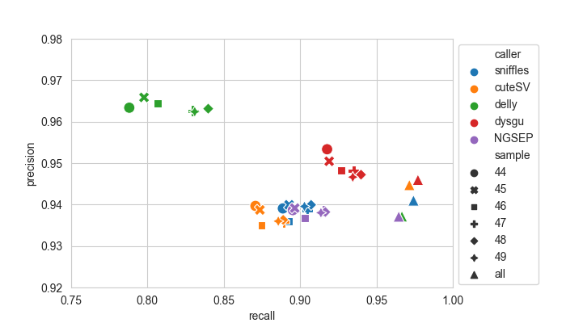

:bar_chart: SV Benchmark using PacBio HiFi data
===============================================

This is a reproducible benchmark of structural variant calling using PacBio HiFi reads. The truth set is described in detail here:

[A robust benchmark for detection of germline large deletions and insertions. Zook et al., 2020. Nature Biotechnology](https://www.nature.com/articles/s41587-020-0538-8)




Single run average:
| caller   |      TP |      FP |       FN |   precision |   recall |    f1 |   gt_concordance |
|:---------|--------:|--------:|---------:|------------:|---------:|------:|-----------------:|
| sniffles | 8659.83 | 564     |  981.167 |       0.939 |    0.898 | 0.918 |            0.936 |
| cuteSV   | 8490.17 | 571.833 | 1150.83  |       0.937 |    0.881 | 0.908 |            0.92  |
| delly    | 7864.5  | 297     | 1776.5   |       0.964 |    0.816 | 0.883 |            0.911 |
| dysgu    | 8955.83 | 481.5   |  685.167 |       0.949 |    0.929 | 0.939 |            0.929 |
| NGSEP    | 8742.5  | 575.833 |  898.5   |       0.938 |    0.907 | 0.922 |            0.926 |

Merged runs:
| caller   |   TP |   FP |   FN |   precision |   recall |     f1 |   gt_concordance |
|:---------|-----:|-----:|-----:|------------:|---------:|-------:|-----------------:|
| sniffles | 9393 |  589 |  248 |      0.941  |   0.9743 | 0.9573 |           0.9772 |
| cuteSV   | 9367 |  548 |  274 |      0.9447 |   0.9716 | 0.958  |           0.9863 |
| delly    | 9320 |  625 |  321 |      0.9372 |   0.9667 | 0.9517 |           0.9827 |
| dysgu    | 9421 |  538 |  220 |      0.946  |   0.9772 | 0.9613 |           0.9728 |
| NGSEP    | 9300 |  624 |  341 |      0.9371 |   0.9646 | 0.9507 |           0.9682 |


Reads were from PacBio Sequel II HiFi. Six runs were tested individually (~7-8X coverage), or after merging together. SV callers tested were as follows:

- [sniffles v2.2.0](https://github.com/fritzsedlazeck/Sniffles)

- [cuteSV v2.0.3](https://github.com/tjiangHIT/cuteSV)

- [delly v1.1.6](https://github.com/dellytools/delly)

- [dysgu v1.6.0](https://github.com/kcleal/dysgu)

- [NGSEP v4.3.2](https://github.com/NGSEP/NGSEPcore)


For benchmarking [truvari v4.0.0](https://github.com/ACEnglish/truvari) was used with parameters `-r 1000 --passonly -p 0 --dup-to-ins`

Run the benchmark.sh script or follow along below. 

### Requirements:

- ~ 350 Gb space, 64 gb Ram, 8 cores
- Docker / Singularity (Required for Mac, optional for Linux)
- Job scheduler of some kind (slurm used here)


## Setup environment

```
mkdir benchmark && cd benchmark
docker run -it --memory="64g" --mount src="${PWD}",target=/results,type=bind condaforge/mambaforge
mamba update conda -y && cd results
```
Note, you may need to set the memory and swap space manually using Docker Desktop on Mac.

Install tools:

```
mamba create -c bioconda -c conda-forge -n bench python=3.9 awscli samtools=1.17 minimap2=2.26 minimap2 sniffles=2.2.0 cuteSV=2.0.3 truvari=4.0.0 delly=1.1.6 -y
conda activate bench
pip install dysgu==1.6.0
wget https://github.com/NGSEP/NGSEPcore/releases/download/v4.3.2/NGSEPcore_4.3.2.jar
```

## Grab datasets

Reference genome:
```
wget https://ftp-trace.ncbi.nlm.nih.gov/ReferenceSamples/giab/release/references/GRCh37/hs37d5.fa.gz
gunzip hs37d5.fa.gz && samtools faidx hs37d5.fa
```

PacBio reads found online at SRA or EBI under accession [PRJNA586863](https://www.ebi.ac.uk/ena/browser/view/PRJNA586863):
```
for i in {44..49}; do wget -nc ftp://ftp.sra.ebi.ac.uk/vol1/fastq/SRR103/0${i}/SRR103822${i}/SRR103822${i}_subreads.fastq.gz; done
```

SV truth set:
```
ftp=https://ftp-trace.ncbi.nlm.nih.gov/ReferenceSamples/giab/release/AshkenazimTrio/HG002_NA24385_son/NIST_SV_v0.6
wget ${ftp}/HG002_SVs_Tier1_v0.6.bed
wget ${ftp}/HG002_SVs_Tier1_v0.6.vcf.gz
wget ${ftp}/HG002_SVs_Tier1_v0.6.vcf.gz.tbi
```

## Run SV callers

Map data and call SVs for each run:

```
for i in {44..49}; do \

$(cat > job${i}.sh << EOF
#!/bin/bash
#SBATCH --job-name=joball
#SBATCH --partition=compute
#SBATCH --output=out.${i}.%J
#SBATCH --error=err.${i}.%J
#SBATCH --time=0-24:00
#SBATCH --mem-per-cpu=8G
#SBATCH --ntasks=1
#SBATCH --cpus-per-task=8

minimap2 -t8 -a -x map-hifi hs37d5.fa SRR103822${i}_subreads.fastq.gz | \
  samtools view -bh - | \
  samtools sort -o SRR103822${i}.mm2.bam -
samtools index -@8 SRR103822${i}.mm2.bam

sniffles --threads 8 --input SRR103822${i}.mm2.bam --vcf HG002_${i}.pacbio.sniffles.vcf

dysgu call --mode pacbio --procs 8 -x --clean hs37d5.fa wd_${i} SRR103822${i}.mm2.bam -o HG002_${i}.pacbio.dysgu.vcf

mkdir wd_cuteSV_${i}
cuteSV -t 8 -s 2 --genotype SRR103822${i}.mm2.bam hs37d5.fa HG002_${i}.pacbio.cuteSV.vcf wd_cuteSV_${i}

delly lr -g hs37d5.fa SRR103822${i}.mm2.bam > HG002_${i}.pacbio.delly.vcf

java -jar NGSEPcore_4.3.2.jar SingleSampleVariantsDetector -runOnlySVs -runLongReadSVs -i SRR103822${i}.mm2.bam -r hs37d5.fa -o HG002_${i}.pacbio.NGSEP.vcf

EOF
)
  # change this to 'bash job${i}' if running without slurm
  sbatch job${i}.sh
done
```

Merge runs and call SVs:

```
$(cat > joball.sh << EOF
#!/bin/bash
#SBATCH --job-name=joball
#SBATCH --partition=compute
#SBATCH --output=out.all.%J
#SBATCH --error=err.all.%J
#SBATCH --time=0-24:00
#SBATCH --mem-per-cpu=8G
#SBATCH --ntasks=1
#SBATCH --cpus-per-task=8

samtools merge -@8 -o all.bam *mm2.bam; samtools index -@8 all.bam

dysgu call --mode pacbio --procs 8 -x hs37d5.fa wd_all all.bam -o HG002_all.pacbio.dysgu2.vcf

sniffles --threads 8 --input all.bam --vcf HG002_all.pacbio.sniffles.vcf

mkdir wd_cuteSV_all
cuteSV -t 8 --genotype all.bam hs37d5.fa HG002_all.pacbio.cuteSV.vcf wd_cuteSV_all

delly lr -g hs37d5.fa all.bam > HG002_all.pacbio.delly.vcf

java -jar -Xmx64G NGSEPcore_4.3.2.jar SingleSampleVariantsDetector -runOnlySVs -runLongReadSVs -i all.bam -r hs37d5.fa -o HG002_all.pacbio.NGSEP.vcf

EOF
)
```


## Benchmark

Run truvari:
```
callers=( "sniffles" "cuteSV" "dysgu" "delly" "NGSEP.vcf_SVsLongReads" )

for i in {44..49}
do
  for name in "${callers[@]}"
  do
    bgzip -f HG002_${i}.pacbio.${name}.vcf
    tabix -f HG002_${i}.pacbio.${name}.vcf.gz
    truvari bench -f hs37d5.fa \
                  -b HG002_SVs_Tier1_v0.6.vcf.gz \
                  --includebed HG002_SVs_Tier1_v0.6.bed \
                  -c HG002_${i}.pacbio.${name}.vcf.gz \
                  --passonly -r 1000 -p 0 --dup-to-ins \
                  -o truvari_${i}_${name}
  done
done


for name in "${callers[@]}"
do
  bgzip -f HG002_all.pacbio.${name}.vcf
  tabix -f HG002_all.pacbio.${name}.vcf.gz
  truvari bench -f hs37d5.fa \
                -b HG002_SVs_Tier1_v0.6.vcf.gz \
                --includebed HG002_SVs_Tier1_v0.6.bed \
                -c HG002_all.pacbio.${name}.vcf.gz \
                --passonly -r 1000 -p 0 --dup-to-ins \
                -o truvari_all_${name}
done
```

Run the plotting script:

```python3 plot_benchmark.py```


